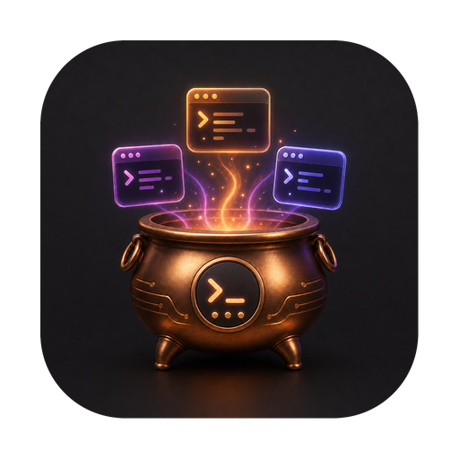

<p align="center">
  
</p>

<h1 align="center">Claudron</h1>

<p align="center">
  A pane of glass over every <a href="https://docs.anthropic.com/en/docs/claude-code">Claude Code</a> session on your machine.
</p>

<p align="center">
  
  
  
</p>

Running ten or more concurrent Claude Code sessions across terminal tabs creates three problems:
closing a tab kills the session and recovery is a hunt, there is no way to see what each session
is doing without switching to it, and tab titles squish into illegibility.

Claudron indexes every session on the machine, shows you what each one said and did, tracks the
git state of the repo it is working in, and gets you back to any of them in one click.

## Features

- **Indexes every interactive session** across all `~/.claude/projects` directories at once —
  including sessions `claude --resume` cannot see, because `--resume` only lists the *current*
  directory's project.
- **Conversation view** — read any session's transcript as a conversation: prompts, responses,
  tool calls with their results, and nested subagent runs, rendered from the JSONL rather than
  from a scrollback buffer. Live sessions tail as they write.
- **Git tab** — branch and cleanliness, ahead/behind against upstream, whether the directory is
  a worktree and which repo it belongs to, plus the open pull request and its CI rollup.
- **Guarded worktree removal** — remove a session's worktree from the app, refused when the
  directory is dirty, is not a worktree, or has a live process anywhere inside it.
- **Notes and status per session**, persisted independently of whether the session is alive.
  Notes survive the session dying and Claudron restarting.
- **Jump to the terminal tab** already running a session, or **resume** a dead one in a new tab,
  launched in the correct working directory.
- **Liveness at a glance** — which sessions have a live `claude` process, which died mid-work,
  and which ended cleanly.
- **Claude Code version per session**, highlighted when a session is running behind the newest
  version seen, so stale sessions are obvious.
- **Groups by repo** with readable `repo ▸ worktree` labels, so sibling worktrees stay
  distinguishable instead of truncating into ambiguity.

## Requirements

- **macOS** — terminal integration is AppleScript-based
- **[Claude Code CLI](https://docs.anthropic.com/en/docs/claude-code)**
- **[Node.js](https://nodejs.org/) 18+** and **[Yarn](https://yarnpkg.com/)**
- **[Rust](https://rustup.rs/)** stable, for building from source
- **iTerm2** for jump-to-tab, with shell integration installed — that is what reports each tab's
  working directory
- **[GitHub CLI](https://cli.github.com/) (`gh`)**, authenticated, for pull request and CI status
  (optional — the other git blocks work without it)

## Build from source

```bash
git clone https://github.com/pktstorm/claudron.git
cd claudron

yarn install
make dev     # run in development
make build   # produce a release .app bundle
```

The bundle lands in `src-tauri/target/release/bundle/macos/Claudron.app`.

## Development

```bash
make dev        # Vite + Tauri with hot reload
make test       # Rust and frontend suites
make test-rust  # cargo test
make test-ui    # vitest
make lint       # clippy -D warnings, then tsc --noEmit
```

Some tests are `#[ignore]`d because they run against a real repository. Point them at one:

```bash
CLAUDRON_TEST_REPO=~/code/some-repo \
  cargo test --manifest-path src-tauri/Cargo.toml -- --ignored --nocapture
```

## How it works

Claudron is a **projection of state it does not own**. Every session it lists is derived from
transcript files on disk and from the process table. The only thing Claudron owns is your notes,
status, and display names, keyed by session id — so a crash loses nothing.

| Layer | Responsibility |
|---|---|
| `src-tauri/src/transcript.rs` | Parse one `.jsonl` transcript into a session summary |
| `src-tauri/src/index.rs` | Walk all project dirs, mtime-cached, produce sorted sessions |
| `src-tauri/src/conversation/` | Turn a transcript into rendered turns, tool calls, subagents |
| `src-tauri/src/git/` | Bounded `git`/`gh` invocation, local inspection, PR and CI rollup |
| `src-tauri/src/project.rs` | Turn a cwd into a readable `repo` / `repo ▸ worktree` label |
| `src-tauri/src/process.rs` | Find live `claude` CLI processes and their directories |
| `src-tauri/src/annotations.rs` | Load and save the annotation store, atomically |
| `src-tauri/src/actions.rs` | Build the terminal focus and resume AppleScripts |
| `src/` | React UI — reaches the backend only through `src/api/` |

The UI never touches the filesystem and never spawns a process. All of that lives in Rust.

### Details that carry more weight than they look

**Only `entrypoint: "cli"` transcripts are indexed.** The overwhelming majority of transcript
files on a working machine are `sdk-py` subagent runs. Without this filter the list is mostly
noise.

**The index cache keys on nanosecond mtime plus file size, and caches rejections too.**
Whole-second mtime would serve stale data for actively-streaming sessions, which write several
times per second. Caching only successful parses would re-parse every rejected file on each poll.

**`annotations::load` treats a corrupt store as an error, never as an empty one.** Returning
empty would let the next save atomically overwrite every existing note with one — the atomic
write is exactly what would make that clobber land cleanly.

**Every subprocess is bounded by a timeout, and reads both pipes concurrently.** A child that
writes more than the pipe buffer while nothing drains it blocks forever; draining only after the
process exits deadlocks on any large output.

**Worktree removal compares canonicalized paths, and matches containment rather than equality.**
`lsof` reports resolved paths while recorded session directories are not resolved, so raw string
comparison silently fails to match. Git enforces its own refusals for dirty worktrees, but has no
concept of process occupancy — that guard is the only thing protecting a running session.

## Status

The read-only dashboard, conversation view, and git tab are complete. Planned work is tracked in
[issues](../../issues); the design specs and implementation plans live in `docs/superpowers/`.

Not built yet: tmux-backed sessions so closing a tab detaches instead of kills, an embedded
terminal, and replying to a session from inside Claudron.

## Contributing

See [CONTRIBUTING.md](CONTRIBUTING.md). Issues and pull requests are welcome.

## License

[MIT](LICENSE) © Caitlin Halla and Sam Thirlwall
